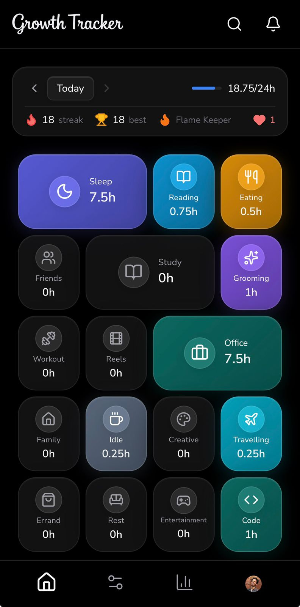
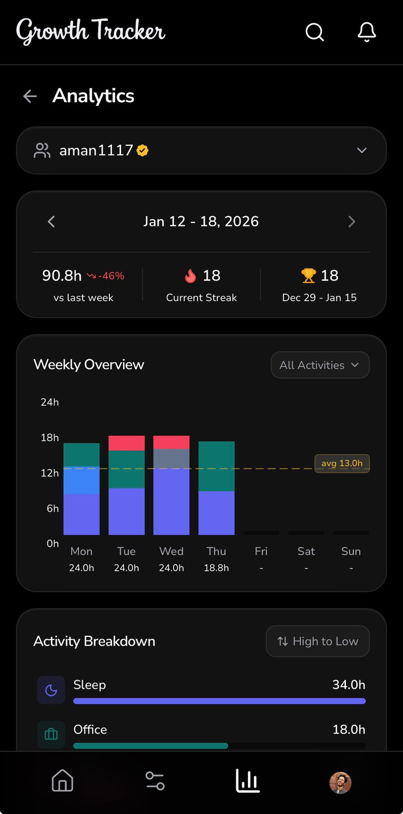
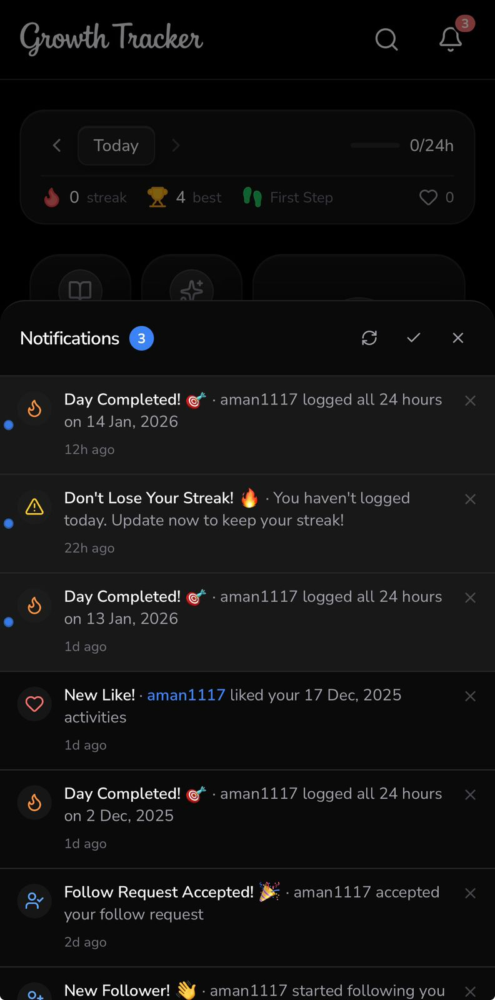
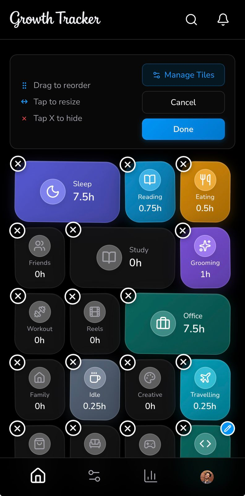
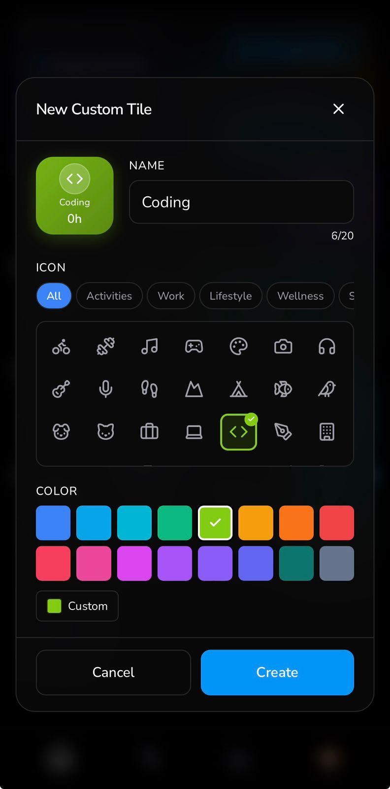
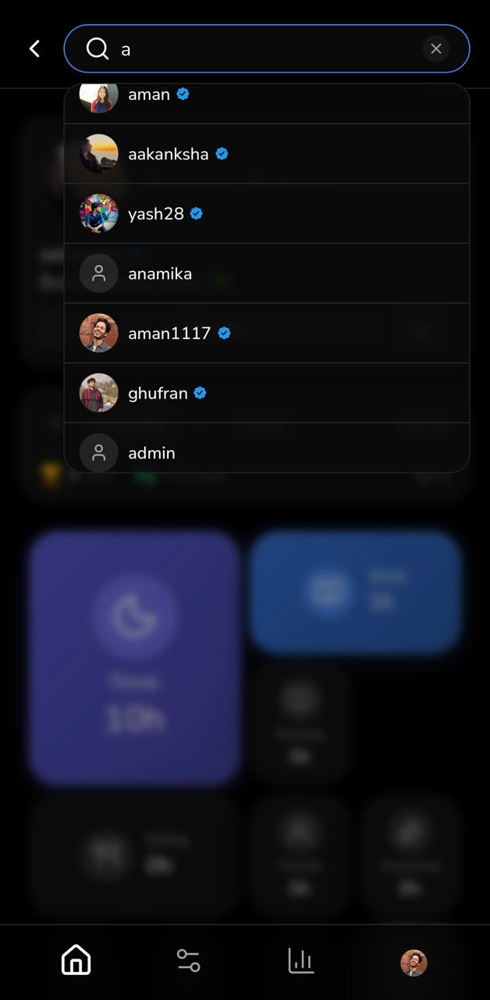
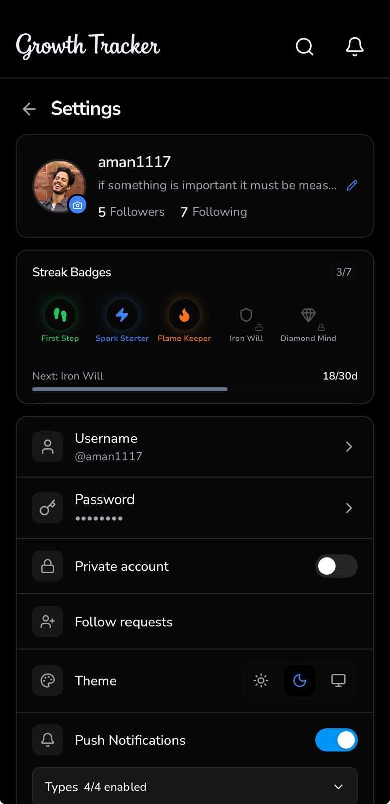

<picture>
  <source media="(prefers-color-scheme: dark)" srcset="frontend/public/logo-light.png">
  <source media="(prefers-color-scheme: light)" srcset="frontend/public/logo.png">
  
</picture>

### Track all 24 hours. Build streaks. Grow intentionally.

---

## 💡 What is Growth Tracker?

We all have 24 hours in a day — but where do they actually go?

**Growth Tracker** helps you answer that question by logging time across meaningful life categories like sleep, work, fitness, family, and more. Complete your day by logging all 24 hours, stay consistent, and watch your streak grow!

---

## 📸 Screenshots

### 🔐 Login → 📊 Dashboard

  
  &nbsp;&nbsp;&nbsp;
  

> **Left:** Clean authentication screen to get started  
> **Right:** Your daily hub — see progress, streak, and activity tiles at a glance

---

### 📈 Analytics → 🔔 Notifications

  
  &nbsp;&nbsp;&nbsp;
  

> **Left:** Weekly insights into how you spend your time  
> **Right:** Stay on track with streak reminders and updates

---

### ✏️ Customize Your Tiles

  
  &nbsp;&nbsp;&nbsp;
  

> Drag-and-drop to reorder tiles, create custom activities, or hide what you don't need

---

### 🔍 Search Users → ⚙️ Settings

  
  &nbsp;&nbsp;&nbsp;
  

> **Left:** Find and follow other users to see how they spend their time  
> **Right:** Customize your experience — theme, notifications, profile

---

## ✨ Features

| Feature | Description |
|---------|-------------|
| ⏱️ **24-Hour Tracking** | Log activities until your day is complete |
| 🔥 **Streak System** | Build consistency — don't break the chain! |
| 🏆 **Badges** | Earn achievements for milestones |
| 👥 **Social** | Follow users, like activities, view profiles |
| 🔔 **Push Notifications** | Streak reminders to keep you on track |
| 🎨 **Tile Customization** | Drag-drop reorder, custom tiles, hide/show |
| 🌗 **Dark & Light Mode** | Beautiful glassmorphism UI in both themes |
| 📱 **PWA Support** | Install as app on any device |

---

## 🎯 Activity Categories

Track time across **16 life categories**:

| | | | |
|:---:|:---:|:---:|:---:|
| 😴 Sleep | 📚 Study | 📖 Book Reading | 🍽️ Eating |
| 👥 Friends | 💆 Grooming | 🏋️ Workout | 📱 Reels |
| 🏠 Family | ☕ Idle | 🎨 Creative | ✈️ Travelling |
| 🛒 Errand | 🛋️ Rest | 🎮 Entertainment | 💼 Office |

*Plus create your own custom categories!*

---

## 🛠️ Tech Stack

| Frontend | Backend |
|:--------:|:-------:|
| React 19 | Go 1.24 |
| TypeScript | Fiber v2 |
| Vite | PostgreSQL 16 |
| Zustand | Redis 7 |
| PWA | Azure Blob |

---

## 🚀 Getting Started

Ready to run locally? Check out the full setup guide:

👉 **[LOCAL_DEV_README.md](LOCAL_DEV_README.md)**

---

## 🤝 Contributing

Contributions are welcome! Here's how you can help:

1. 🐛 **Report bugs** — Open an issue describing the problem
2. 💡 **Suggest features** — Share your ideas in discussions
3. 🔧 **Submit PRs** — Fork, create a branch, and submit a pull request

---

## 📋 TODOs

- [ ] Export data to CSV/PDF
- [ ] Goal setting per activity category
- [ ] Unit test cases
- [ ] Add attachments to activities
- [ ] Optimized photo upload
- [ ] Story-like "updated their day" feature
- [ ] Streak freeze days
- [ ] Verified user criteria
- [ ] Cleanup for stale subscriptions

