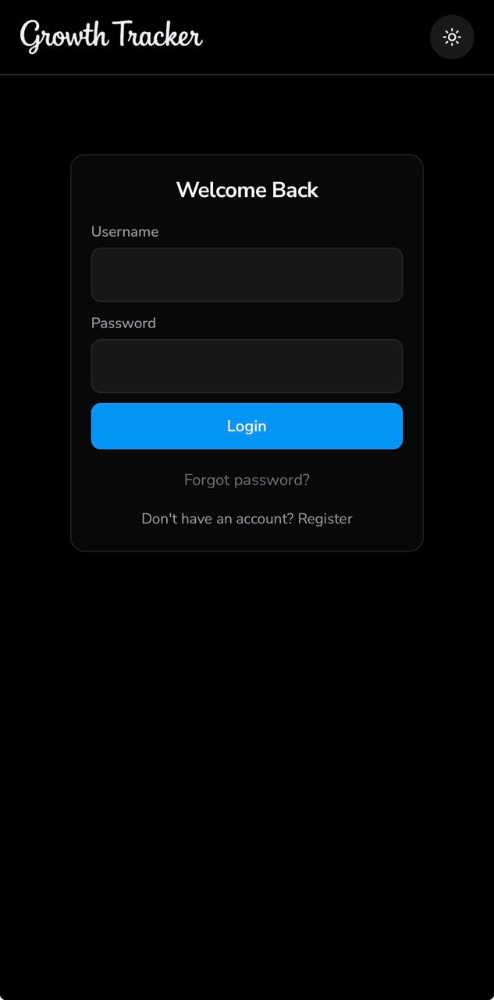
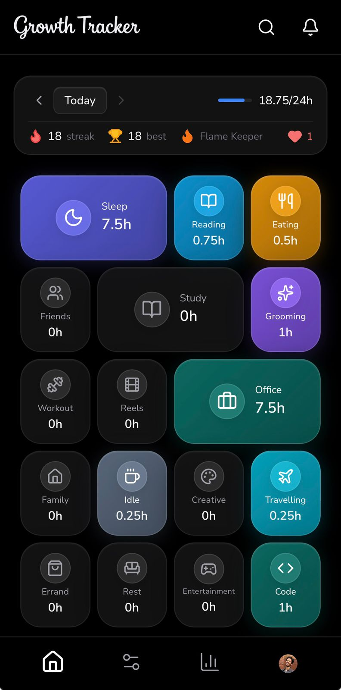
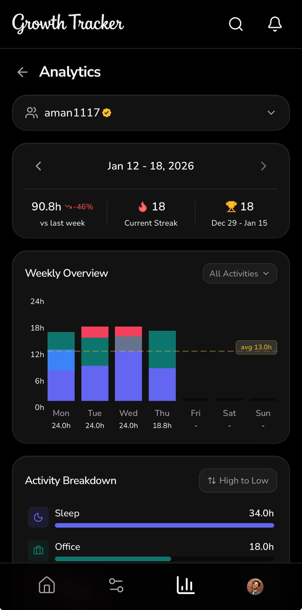
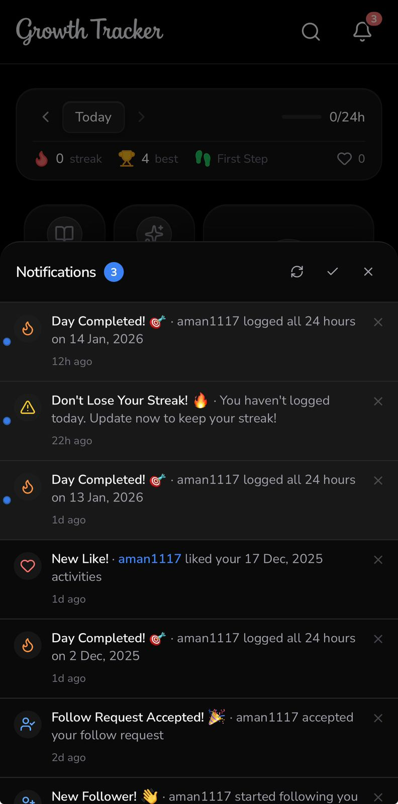
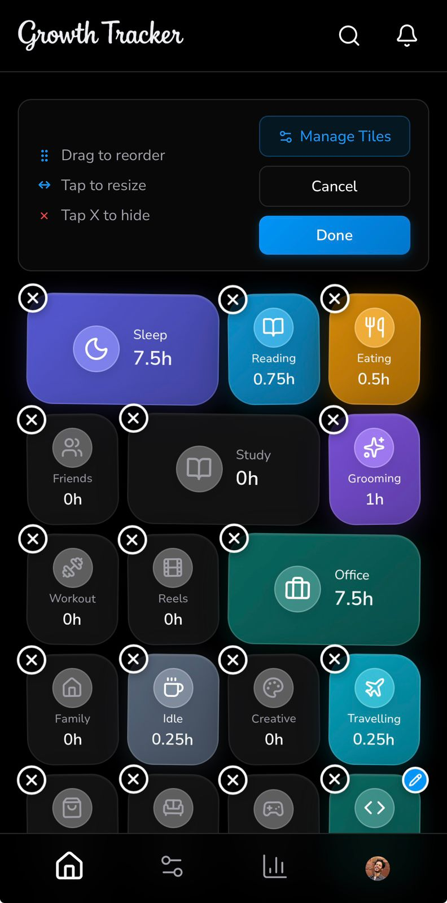
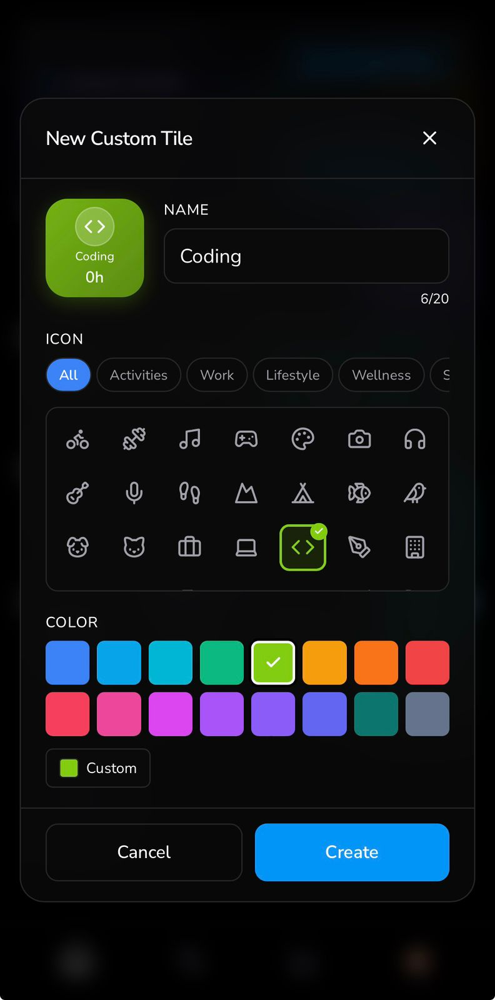
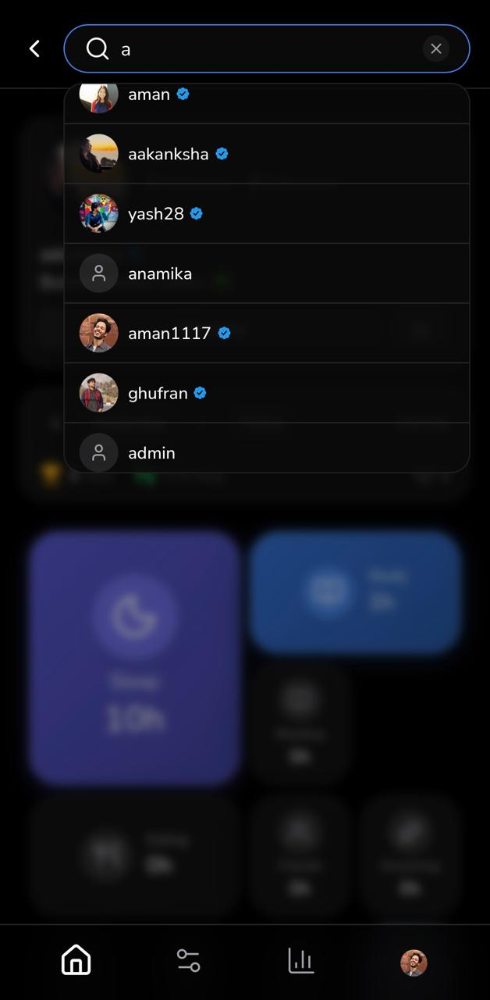
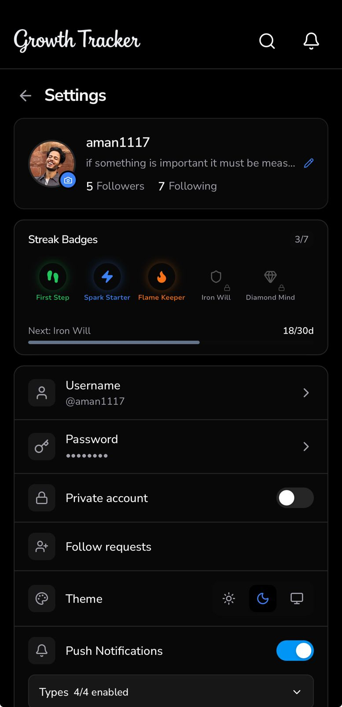

<div align="center">

<picture>
  <source media="(prefers-color-scheme: dark)" srcset="frontend/public/logo-light.png">
  <source media="(prefers-color-scheme: light)" srcset="frontend/public/logo.png">
  
</picture>

### Track all 24 hours. Build streaks. Grow intentionally.

[](https://github.com/aman1117/growth-tracker/actions/workflows/ci.yml)
[](LICENSE)
[](https://react.dev/)
[](https://go.dev/)
[](https://www.postgresql.org/)

</div>

Growth Tracker is a full-stack app for logging how you spend all 24 hours of your day, building streaks, and sharing progress with friends.

## What It Does

Growth Tracker helps you account for your day across meaningful categories like sleep, study, work, fitness, family, and rest. The core idea is simple: complete your 24-hour day, stay consistent, and use streaks, reminders, and lightweight social features to keep momentum.

## Screenshots

### Login and dashboard

<p align="center">
  
  &nbsp;&nbsp;&nbsp;
  
</p>

### Analytics and notifications

<p align="center">
  
  &nbsp;&nbsp;&nbsp;
  
</p>

### Tile customization

<p align="center">
  
  &nbsp;&nbsp;&nbsp;
  
</p>

### Search and settings

<p align="center">
  
  &nbsp;&nbsp;&nbsp;
  
</p>

## Features

- 24-hour day tracking across built-in and custom categories.
- Streaks and badges for consistency and milestone progress.
- Social features including profiles, follows, likes, comments, and story-style activity photos.
- Push notifications for streak reminders and account activity.
- Drag-and-drop tile customization.
- Dark and light themes.
- Progressive Web App support.

## Architecture Overview

The actively maintained system has two main surfaces:

- `frontend/`: React 19, TypeScript, Vite, Zustand, and PWA support.
- `backend/`: Go 1.24, Fiber, GORM, PostgreSQL, Redis, Azure Blob Storage, Azure Service Bus.

Supporting local development services are orchestrated through `docker-compose.yml`:

- PostgreSQL for primary data.
- Redis for cache and async coordination.
- Azurite for local blob storage emulation.
- Mailpit for local email testing.

## Repository Structure

```text
.
├── frontend/      # Active React application
├── backend/       # Active Go API and workers
├── docs/          # Project assets and screenshots
├── android/       # Inactive reference implementation
└── twa/           # Inactive Trusted Web Activity assets
```

## Maintenance Status

Active development is focused on:

- `frontend/`
- `backend/`
- `docker-compose.yml`
- root documentation and contributor tooling

The following directories are retained for reference and are not under active development:

- `android/`
- `twa/`

Pull requests for inactive areas may be declined unless they support a broader repository need.

## Tech Stack

| Area | Technology |
| --- | --- |
| Frontend | React 19, TypeScript, Vite, Zustand, PWA |
| Backend | Go 1.24, Fiber, GORM |
| Data | PostgreSQL 16, Redis 7 |
| Storage and messaging | Azure Blob Storage, Azure Service Bus |
| Local development | Docker Compose, Mailpit, Azurite |

## Prerequisites

- Docker Desktop
- Node.js 20+
- npm 10+
- Go 1.24+

## Installation

### Recommended path

Use Docker Compose for the full stack:

```bash
docker compose up --build
```

Then open:

- Frontend: `http://localhost:5173`
- Backend API: `http://localhost:8000`
- Mailpit: `http://localhost:8025`

### Detailed local setup

See [LOCAL_DEV_README.md](LOCAL_DEV_README.md) for:

- local environment details
- debugging with Delve
- seed workflows
- troubleshooting steps
- local service architecture

## Environment Setup

Use the provided example files as your starting point:

- `.env.example`
- `.env.local.example`
- `frontend/.env.example`

Important rules:

- Never commit real credentials or production secrets.
- Treat any credential exposed in git history as compromised and rotate it.
- Prefer local development credentials and emulators for all contributor workflows.

## Development Commands

| Command | Purpose |
| --- | --- |
| `docker compose up --build` | Start the full local stack |
| `docker compose down` | Stop the local stack |
| `make setup` | Install frontend dependencies |
| `make check` | Run frontend and backend validation |
| `cd frontend && npm run dev` | Start the frontend only |
| `cd frontend && npm run lint` | Run frontend lint checks |
| `cd frontend && npm run format:check` | Check frontend formatting |
| `cd frontend && npm run typecheck` | Run frontend type checking |
| `cd frontend && npm run build` | Build the frontend |
| `cd backend && go fmt ./...` | Format backend packages |
| `cd backend && go vet ./...` | Run backend vet |
| `cd backend && go build ./...` | Build backend packages |

## Testing and Validation

This repository does not currently ship a committed automated test suite.

Until that changes, contributors should validate work with:

- frontend lint
- frontend format check
- frontend typecheck
- frontend production build
- backend format check
- backend vet
- backend build
- manual verification using the Docker Compose environment

## Build and Production Run

- Frontend production assets are built with `npm run build` in `frontend/`.
- Backend containers are built from `backend/Dockerfile` and `backend/Dockerfile.pushworker`.
- Deployment workflows for the backend and push worker live in `.github/workflows/`.

## Deployment Overview

The current repository includes GitHub Actions for deploying:

- the backend API to Azure Container Apps
- the push worker to Azure Container Apps

Local development uses Docker Compose and does not require Azure credentials unless you are testing cloud-backed integrations directly.

## Contributing

Start with [CONTRIBUTING.md](CONTRIBUTING.md).

Also review:

- [CODE_OF_CONDUCT.md](CODE_OF_CONDUCT.md)
- [SECURITY.md](SECURITY.md)
- [SUPPORT.md](SUPPORT.md)

## License

This repository is licensed under the [MIT License](LICENSE).

## Maintainer

Maintained by `@aman1117`.

If you want to contribute, open an issue or pull request with enough context to reproduce, review, and validate the change.


